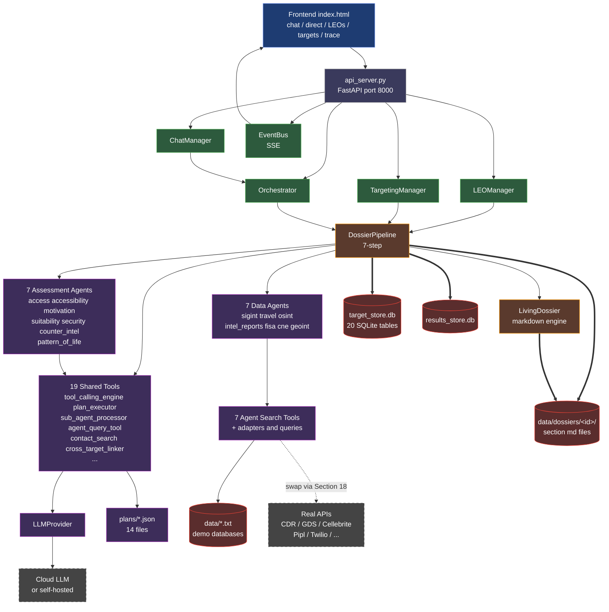
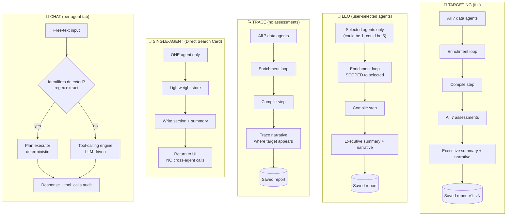
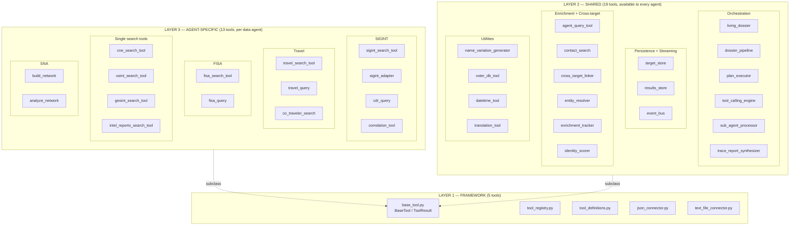
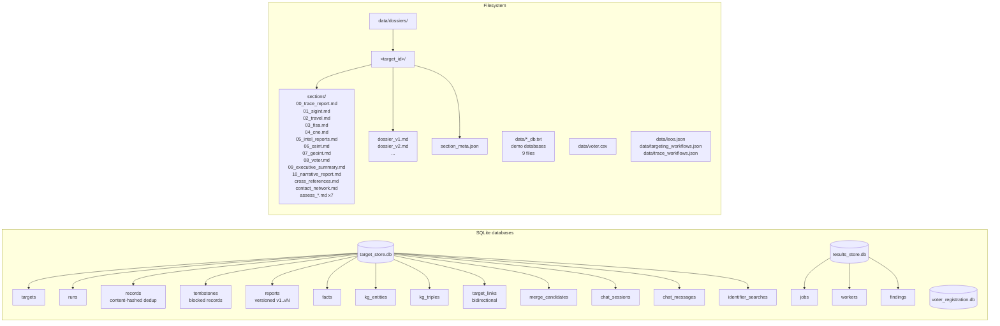
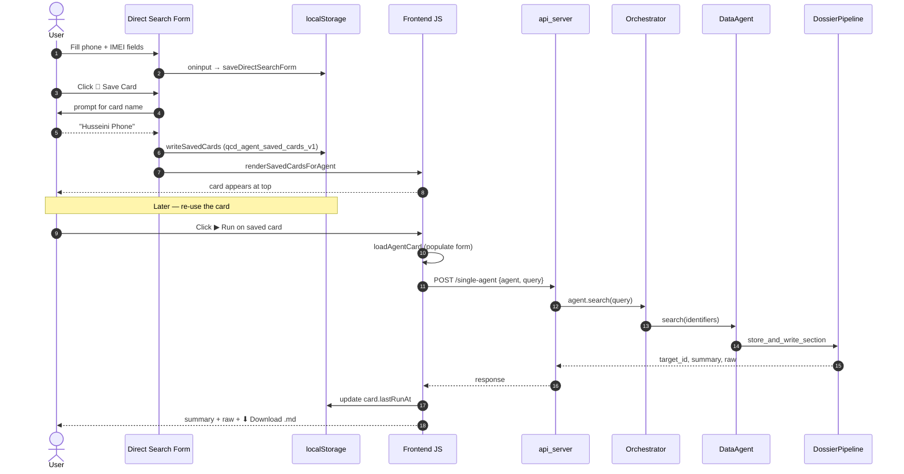
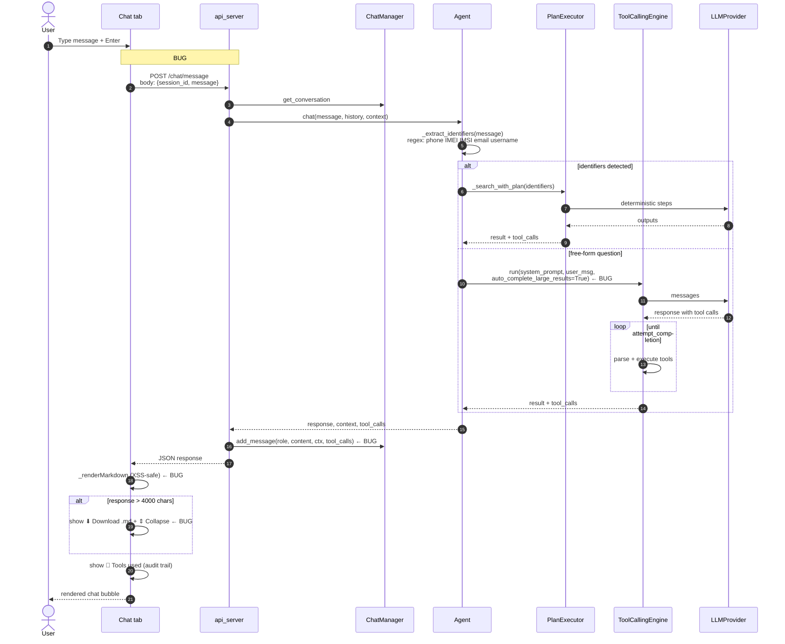

# AI Agent Platform — Visual Architecture Reference

> **Purpose:** every diagram in one file. Use this to onboard a new dev, brief a stakeholder, or feed into another tool to render proper visuals.
>
> **Diagram styles included:**
> 1. The Big Messy Picture (ASCII wall-map — everything at once)
> 2. Mermaid flowcharts (pipeline, workflows, tool stack, persistence, request flow)
> 3. Sequence diagrams (LEO run, Direct Search, Chat)
> 4. Bug-fix before/after (cross-agent leak)
> 5. External-tool prompts (drop into Mermaid Live, Excalidraw, draw.io, DALL-E, ChatGPT image gen)

> **How to render:**
> - Mermaid blocks render natively in GitHub, GitLab, VS Code (with extension), Obsidian, Notion. For a one-off render: paste into [mermaid.live](https://mermaid.live).
> - ASCII renders anywhere — terminal, vim, plain text editor.
> - Image-prompt sections at the bottom are written to be pasted directly into image-generation tools.

---

## 1. THE BIG MESSY PICTURE — Everything at once (ASCII)

```
                                  ┌──────────────────────────────────────────┐
                                  │             FRONTEND (single-page)        │
                                  │   V2/frontend/index.html  (~3150 lines)  │
                                  │  ┌────────┐ ┌────────┐ ┌────────┐ ┌────┐ │
                                  │  │Targets │ │ LEOs   │ │ Trace  │ │Chat│ │
                                  │  │ panel  │ │ panel  │ │ panel  │ │tabs│ │
                                  │  └────────┘ └────────┘ └────────┘ └────┘ │
                                  │  ┌─────────────────────────────────────┐ │
                                  │  │ Per-Agent: 💬 Chat | 🔎 Direct      │ │
                                  │  │  Direct Search has Saved Cards UI   │ │
                                  │  │  (localStorage qcd_agent_saved_*)   │ │
                                  │  └─────────────────────────────────────┘ │
                                  └────────────────────┬─────────────────────┘
                                                       │ JSON over HTTP + SSE
                                                       │
              ┌────────────────────────────────────────▼──────────────────────────────────────┐
              │                          api_server.py  (FastAPI, port :8000)                  │
              │   /chat/message   /single-agent   /agentic-search   /leo/*   /targeting/*     │
              │   /trace/*        /targets/*      /tools/*           /events/{run_id} (SSE)   │
              └─┬──────────────────┬─────────────────┬─────────────────┬───────────────────┬──┘
                │                  │                 │                 │                   │
                ▼                  ▼                 ▼                 ▼                   ▼
        ┌──────────────┐  ┌────────────────┐  ┌─────────────┐  ┌──────────────┐  ┌────────────┐
        │ ChatManager  │  │ Orchestrator   │  │ LEOManager  │  │ TargetingMgr │  │ EventBus   │
        │ (sessions in │  │ (boots all 16  │  │ (LEO CRUD,  │  │ (Targeting + │  │ (SSE pub/  │
        │  TargetStore)│  │  agents, wires │  │  schedules) │  │  Trace runs) │  │  sub queue)│
        └──────┬───────┘  │  tools, runs   │  └──────┬──────┘  └──────┬───────┘  └─────┬──────┘
               │          │  pipelines)    │         │                │                │
               │          └───────┬────────┘         │                │                │
               │                  │                  │                │                │
               │       ┌──────────▼──────────────────▼────────────────▼─────────┐      │
               │       │            DOSSIER PIPELINE  (the conductor)            │      │
               │       │   tools/shared/dossier_pipeline.py · run(workflow_type) │      │
               │       │                                                          │      │
               │       │  STEP 1: INPUT      → create dossier dir                 │      │
               │       │  STEP 2: EXPAND     → name variations + phone correlate │      │
               │       │  STEP 3: COLLECT    → parallel data agents → sections   │      │
               │       │  STEP 4: ENRICH     → discover IDs, search, loop        │──────┤ (emits events
               │       │  STEP 5: COMPILE    → cross-refs, contacts, voter       │      │  every step)
               │       │  STEP 6: ASSESS     → 7 chunk-by-chunk LLM scans        │      │
               │       │  STEP 7: FINAL      → exec summary + narrative + save   │      │
               │       └────┬───────────────────────┬─────────────────────────────┘      │
               │            │                       │                                    │
               │            ▼                       ▼                                    │
               │    ┌─────────────────┐    ┌────────────────────┐                       │
               │    │ LIVING DOSSIER  │    │ DATA AGENTS (7)    │                       │
               │    │ (markdown engine│    │  travel  sigint    │                       │
               │    │  for each       │    │  osint   intel_rpt │                       │
               │    │  target)        │    │  fisa    cne       │                       │
               │    │                 │    │  geoint            │                       │
               │    │  formatters per │    └────────┬───────────┘                       │
               │    │  agent +        │             │                                    │
               │    │  ASSESSMENT_*   │             ▼                                    │
               │    └────────┬────────┘    ┌──────────────────────────────┐             │
               │             │             │ AGENT-SPECIFIC SEARCH TOOLS  │             │
               │             │             │  sigint_search   travel_     │             │
               │             │             │  osint_search    fisa_       │             │
               │             │             │  cne_search      geoint_     │             │
               │             │             │  intel_reports_search        │             │
               │             │             │  + adapters (sigint_adapter, │             │
               │             │             │     cdr_query, fisa_query,   │             │
               │             │             │     travel_query,            │             │
               │             │             │     correlation_tool,        │             │
               │             │             │     co_traveler_search)      │             │
               │             │             └────┬─────────────────────────┘             │
               │             │                  │                                        │
               │             │                  ▼                                        │
               │             │           ┌────────────┐    ┌──────────────────────┐    │
               │             │           │  data/*.txt│    │  REAL APIs (you plug │    │
               │             │           │  +voter.csv│    │  in via Section 18   │    │
               │             │           │ (demo data)│    │  override execute()) │    │
               │             │           └────────────┘    │  CDR  · GDS · Cellebrt│    │
               │             │                              │  Pipl · Twilio · etc.│    │
               │             │                              └──────────────────────┘    │
               │             │                                                          │
               │             ▼                                                          │
               │    ┌─────────────────────────────────────────────────────────┐         │
               │    │              SHARED TOOLS (global, every agent)          │         │
               │    │  tool_calling_engine     plan_executor                   │         │
               │    │  sub_agent_processor     trace_report_synthesizer        │         │
               │    │  agent_query_tool        contact_search                  │         │
               │    │  cross_target_linker     entity_resolver                 │         │
               │    │  enrichment_tracker      identity_scorer                 │         │
               │    │  name_variation_gen      voter_db_tool                   │         │
               │    │  datetime_tool           translation_tool                │         │
               │    └────────────────┬─────────────────────────────────────────┘         │
               │                     │                                                   │
               │                     ▼                                                   │
               │              ┌────────────┐    ┌─────────────┐                          │
               │              │ LLMProvider│    │ Plans (JSON)│                          │
               │              │ openai /   │◄───┤ plans/*.json│                          │
               │              │ anthropic /│    │ 14 files    │                          │
               │              │ google     │    └─────────────┘                          │
               │              └─────┬──────┘                                             │
               │                    │                                                    │
               │                    ▼                                                    │
               │           ┌──────────────────┐                                          │
               │           │   LLM API        │                                          │
               │           │   (cloud or self │                                          │
               │           │    -hosted)      │                                          │
               │           └──────────────────┘                                          │
               │                                                                         │
               ▼                                                                         │
       ┌─────────────────────────────────────────────────────────────────────────────────┘
       │                              PERSISTENCE LAYER
       │
       │  ┌────────────────────┐   ┌────────────────────┐   ┌──────────────────────┐
       │  │  target_store.db   │   │  results_store.db  │   │  data/dossiers/      │
       │  │  (SQLite, 20 tbls) │   │  (sub-agent jobs)  │   │  <target_id>/        │
       │  │  - targets         │   │  - jobs            │   │   sections/          │
       │  │  - records (dedup)│   │  - workers         │   │     01_sigint.md     │
       │  │  - tombstones      │   │  - findings        │   │     02_travel.md     │
       │  │  - reports v1..vN  │   └────────────────────┘   │     ... (8 more)     │
       │  │  - facts           │                            │   dossier_v1.md      │
       │  │  - kg_entities     │   ┌────────────────────┐   │   dossier_v2.md      │
       │  │  - kg_triples      │   │  voter_registration│   │   ...                │
       │  │  - target_links    │   │  .db (CSV mirror)  │   │   section_meta.json  │
       │  │  - merge_candidate │   └────────────────────┘   └──────────────────────┘
       │  │  - chat_sessions   │
       │  │  - chat_messages   │
       │  │  - identifier_     │
       │  │     searches       │
       │  └────────────────────┘
       │
       └──────────────────────────────────────────────────────────────────────────────────────


  KEY:  ───►  data/control flow      ═══►  persistence write     ◄───  read
        ┌─┐                          ┌═┐
        │ │  active component        │ │  storage
        └─┘                          └═┘
```

---

## 2. SYSTEM COMPONENT MAP (Mermaid)



---

## 3. THE LIVING DOSSIER PIPELINE — 7 Steps (Mermaid)

```mermaid
flowchart LR
    Start([User input:<br/>identifiers]):::start
    S1[STEP 1<br/>INPUT<br/><br/>create dossier dir<br/>data/dossiers/&lt;target_id&gt;]:::step
    S2[STEP 2<br/>EXPAND<br/><br/>name variations<br/>phone correlation<br/>build search groups]:::step
    S3[STEP 3<br/>COLLECT<br/><br/>parallel data agents<br/>write 01-07 sections<br/>summarize each]:::step
    S4[STEP 4<br/>ENRICH<br/><br/>discover phones/emails<br/>search new IDs<br/>loop until converge<br/>secondary contact search]:::step
    S5[STEP 5<br/>COMPILE<br/><br/>cross-references<br/>contact network<br/>voter check<br/>cross-target links]:::step
    S6{STEP 6<br/>workflow_type?}:::decision
    S6a[ASSESS<br/><br/>7 chunk-by-chunk<br/>LLM scans:<br/>access access motiv<br/>suit sec ci pol]:::step
    S7t[STEP 7 trace<br/>trace report]:::step
    S7l[STEP 7 leo<br/>summary + narrative]:::step
    S7f[STEP 7 final<br/>exec summary +<br/>narrative + save]:::step
    Done([dossier_v&lt;N&gt;.md<br/>+ all sections<br/>+ saved report]):::end

    Start --> S1
    S1 --> S2
    S2 --> S3
    S3 --> S4
    S4 --> S5
    S5 --> S6
    S6 -->|targeting| S6a
    S6 -->|leo| S7l
    S6 -->|trace| S7t
    S6a --> S7f
    S7l --> Done
    S7t --> Done
    S7f --> Done

    classDef start fill:#1e88e5,stroke:#fff,color:#fff
    classDef step fill:#5a3a2d,stroke:#ff9800,color:#fff
    classDef decision fill:#7a5c00,stroke:#fc0,color:#fff
    classDef end fill:#2d5a3d,stroke:#4caf50,color:#fff
```

---

## 4. WORKFLOW TYPES — what runs in each (Mermaid)



---

## 5. TOOL STACK (3 layers, Mermaid)



---

## 6. PERSISTENCE LAYERS (Mermaid)



---

## 7. SEQUENCE — User clicks "Run LEO" (Mermaid)

```mermaid
sequenceDiagram
    autonumber
    actor User
    participant UI as Frontend
    participant API as api_server
    participant LM as LEOManager
    participant Pipe as DossierPipeline
    participant Orch as Orchestrator
    participant Agent as DataAgent
    participant Tool as SearchTool
    participant Dos as LivingDossier
    participant TS as TargetStore
    participant Bus as EventBus

    User->>UI: Click Run LEO
    UI->>API: POST /leo/run/{leo_id}?background=true
    API->>LM: run_leo(leo_id, event_bus)
    LM->>Pipe: run(identifiers, target_id, run_id, agent_keys, "leo")
    Pipe->>Orch: set_active_agent_scope(agent_keys) ← BUG #2 fix
    Pipe->>Bus: emit pipeline_started
    Bus-->>UI: SSE event

    rect rgb(60, 80, 120)
    Note over Pipe: STEP 1-2: INPUT + EXPAND
    Pipe->>Dos: create_dossier(target_id)
    Pipe->>Pipe: _step_2_expand() name + phone variations
    end

    rect rgb(80, 60, 60)
    Note over Pipe: STEP 3: COLLECT (parallel)
    par for each selected agent
        Pipe->>Agent: search(identifiers)
        Agent->>Tool: execute(query, search_terms)
        Tool-->>Agent: ToolResult(data)
        Agent-->>Pipe: results
        Pipe->>Bus: emit agent_complete
        Bus-->>UI: SSE
        Pipe->>Dos: write_agent_section()
        Pipe->>Dos: summarize_section()
        Pipe->>TS: store_records_batch()
    end
    end

    rect rgb(60, 80, 60)
    Note over Pipe: STEP 4: ENRICH
    loop until converged or max iterations
        Pipe->>Pipe: tracker.get_search_queue(allowed_agents) ← BUG #2 fix
        Pipe->>Agent: search(new_identifiers)
        Agent-->>Pipe: more results
        Pipe->>Dos: append_to_section()
    end
    Pipe->>Pipe: _run_secondary_search(search_agents=allowed)
    end

    rect rgb(80, 80, 60)
    Note over Pipe: STEP 5: COMPILE
    Pipe->>Dos: compile_cross_references()
    Pipe->>Dos: compile_contact_network()
    Pipe->>Dos: compile_voter_results()
    Pipe->>Dos: compile_dossier()
    end

    rect rgb(60, 60, 80)
    Note over Pipe: STEP 7: FINAL (LEO skips assessments)
    Pipe->>Dos: generate_executive_summary()
    Pipe->>Dos: generate_narrative_report()
    Pipe->>TS: save_report()
    end

    Pipe->>Orch: set_active_agent_scope(None)
    Pipe-->>LM: result
    LM-->>API: result
    API->>Bus: emit pipeline_complete
    Bus-->>UI: SSE — done
    UI-->>User: dossier ready
```



---

## 8. SEQUENCE — Direct Search Card Save & Run



---

## 9. SEQUENCE — Chat Message (with bug fix)



---

## 10. BUG FIX VISUAL — LEO Single-Agent Leak (Before / After)

```
                BEFORE (BUG #2)                                        AFTER (FIXED)
                ────────────                                            ────────────

User: "LEO with SIGINT only"                              User: "LEO with SIGINT only"
        │                                                          │
        ▼                                                          ▼
┌───────────────────┐                                    ┌───────────────────┐
│  selected_agents  │                                    │  selected_agents  │
│   = ["sigint"]    │                                    │   = ["sigint"]    │
└────────┬──────────┘                                    └────────┬──────────┘
         │                                                        │
         ▼                                                        ▼
   STEP 3 COLLECT                                          STEP 3 COLLECT
   sigint runs ✓                                           sigint runs ✓
         │                                                        │
         ▼                                                        ▼
   STEP 4 ENRICH                                           STEP 4 ENRICH
   tracker.get_search_queue()                              tracker.get_search_queue(
   returns: phones to search                                  allowed_agents=["sigint"])
   in [sigint, fisa, geoint,                               returns: phones to search
        cne, travel, osint,                                   in [sigint] only ✓
        intel_reports]   ⚠️                                       │
         │                                                        ▼
         ▼ ALL 7 AGENTS RUN                              STEP 4b SECONDARY CONTACT SEARCH
                                                          contact_tool.execute(
   STEP 4b SECONDARY CONTACT SEARCH                          search_agents=allowed_agents)
   contact_tool.execute()  ←── NO scope                    only sigint DB scanned ✓
   scans ALL 14 agent DBs   ⚠️
         │                                                        │
         ▼                                                        ▼
   query_agent tool                                        query_agent tool
   no gating                                               check _active_agent_keys
   LLM can call any agent  ⚠️                              reject if not in scope ✓
         │                                                        │
         ▼                                                        ▼
   ❌ travel/cne/fisa/etc.                                 ✅ Only sigint DB touched
      sections ALSO written
      (cross-pollution)


    Files involved in the fix:
    ─────────────────────────
    • tools/shared/enrichment_tracker.py
        - get_search_queue(allowed_agents=...)   ← new param
        - has_converged(allowed_agents=...)      ← new param
    • tools/shared/dossier_pipeline.py
        - run() sets active scope at start
        - _step_4_enrich passes allowed_agents
        - _run_secondary_search(search_agents=...)
    • tools/shared/contact_search.py
        - execute(search_agents=...) honored, was ignored
    • agents/orchestrator.py
        - set_active_agent_scope(agent_keys)     ← new method
        - _handle_agent_query() rejects if out of scope
```

---

## 11. EVENT FLOW — One Pipeline Step → SSE → UI

```
Pipeline                    EventBus                      api_server                  Frontend
───────                     ────────                      ──────────                  ────────

dossier_pipeline.py
    │
    │  self._emit("agent_started", agent_key="sigint", ...)
    │ ──────────────────────►
    │                            event_bus.publish(...)
    │                              │
    │                              │  for each subscriber queue:
    │                              │   queue.put(event)
    │                              │ ──────────────►
    │                                                /events/{run_id} SSE endpoint
    │                                                  │
    │                                                  │  yield "data: {json}\n\n"
    │                                                  │ ─────────────────────►
    │                                                                            EventSource.onmessage
    │                                                                              │
    │                                                                              │ updateProgressPanel()
    │                                                                              ▼
    │                                                                            Live event in
    │                                                                            floating panel
    ▼
(continues to next step,
 emits more events)


  Event types emitted:
  ──────────────────
  pipeline_started     • expand_complete    • agent_started
  agent_complete       • section_ready      • enrichment_iteration
  tool_called          • tool_result        • llm_call_started
  llm_call_complete    • assessment_started • assessment_ready
  dossier_compiled     • synthesis_started  • pipeline_complete
```

---

## 12. EXTERNAL-TOOL PROMPTS — Paste these into image generators

### 12.1 For Mermaid Live Editor (https://mermaid.live)

Each Mermaid block above is independently pasteable. Pick the one you want, copy from `\`\`\`mermaid` to the closing fence, paste into mermaid.live, export as PNG/SVG/PDF.

### 12.2 For draw.io / diagrams.net

Use **Arrange → Insert → Advanced → Mermaid…** then paste any of the Mermaid blocks. draw.io will render it as editable shapes you can rearrange.

### 12.3 For Excalidraw

The big ASCII picture (Section 1) translates well to Excalidraw — open excalidraw.com, **Library → Sketch** mode, freeform from the ASCII. Or use the prompt below.

### 12.4 For ChatGPT / Claude with image generation

Paste the following as a single message:

> **Prompt:**
> Draw a dark-mode system architecture diagram for an AI intelligence-analysis platform. Use a top-down layout with these layers, top to bottom:
>
> **Layer 1 (top, blue):** Frontend — a single-page HTML app showing tabs for Targets, LEOs, Trace, and per-Agent Chat (with sub-tabs Chat | Direct Search), plus a floating pipeline progress panel.
>
> **Layer 2 (gray):** FastAPI server with these endpoints labeled: /chat/message, /single-agent, /agentic-search, /leo/run, /targeting/run, /trace/run, /events SSE.
>
> **Layer 3 (green):** five managers — ChatManager, Orchestrator, LEOManager, TargetingManager, EventBus.
>
> **Layer 4 (orange) — the conductor:** DossierPipeline labeled with 7 steps in order: 1 INPUT, 2 EXPAND, 3 COLLECT, 4 ENRICH, 5 COMPILE, 6 ASSESS, 7 FINAL. Show three branches out of step 6: targeting goes through ASSESS, trace goes to a trace-report node, leo goes straight to summary+narrative.
>
> **Layer 5 (purple):** parallel boxes for the 7 data agents (sigint, travel, osint, intel_reports, fisa, cne, geoint), the 7 assessment agents (access, accessibility, motivation, suitability, security, counter_intel, pattern_of_life), and the 19 shared tools clustered into Orchestration / Persistence / Enrichment / Utilities groups.
>
> **Layer 6 (deep purple):** agent-specific search tools per data agent — sigint has 4 (search, adapter, cdr_query, correlation), travel has 3, fisa has 2, others have 1, plus SNA's build_network and analyze_network.
>
> **Layer 7 (red, persistence):** target_store.db (SQLite, 20 tables), results_store.db, voter.csv, and a filesystem block showing data/dossiers/<id>/sections/*.md plus dossier_v1.md/v2.md.
>
> **Layer 8 (right side, dashed border):** External APIs — LLM (OpenAI/Anthropic/Google) and Real-API plugins (CDR, GDS, Cellebrite, Pipl, Twilio).
>
> Connect with:
> - Solid arrows from frontend down through API into managers and pipeline
> - Dashed arrows from search tools to "Real APIs" labeled "swap via Section 18"
> - Thick double-line arrows from pipeline down to persistence labeled "writes"
> - A dashed arrow from EventBus back up to Frontend labeled "SSE"
>
> Include a small inset on the right showing the LEO single-agent gating fix: a "BEFORE" column where 1 selected agent triggers all 7 to run (red X), and an "AFTER" column where only the selected agent runs (green ✓).
>
> Style: dark navy background, neon highlight colors, rounded rectangles for components, clean labels, technical-blueprint feel.

### 12.5 For DALL-E / Midjourney (more abstract)

> **Prompt:**
> "An intricate dark-mode technical blueprint of an AI intelligence platform. Top-to-bottom data flow diagram. Glowing neon nodes connected by flowing lines representing data movement. Central spine labeled 'Living Dossier Pipeline' with 7 numbered steps. Branches showing parallel agents in purple, persistence layer in red, external APIs in yellow with dashed connections. Style: cyberpunk command center, schematic art, control-room aesthetic, isometric perspective optional. High detail, technical labels in white sans-serif."

### 12.6 For Whimsical / Lucidchart

These tools accept Mermaid imports — same instructions as draw.io.

### 12.7 For PlantUML (alternative syntax)

If your tool prefers PlantUML over Mermaid, here's the system map in PlantUML:

```plantuml
@startuml
skinparam backgroundColor #1a1a2e
skinparam component {
    BackgroundColor #2d3748
    BorderColor #4a5568
    FontColor #e2e8f0
}

package "Frontend" #1e3c72 {
    [index.html] as UI
}

package "API Layer" #3a3a5c {
    [api_server.py] as API
}

package "Managers" #2d5a3d {
    [ChatManager] as CM
    [Orchestrator] as ORCH
    [LEOManager] as LEO
    [TargetingManager] as TM
    [EventBus] as EB
}

package "Pipeline" #5a3a2d {
    [DossierPipeline] as DP
    [LivingDossier] as LD
}

package "Agents (16)" #3d2d5a {
    [7 Data Agents] as DA
    [7 Assessment Agents] as AA
    [SNA Agent] as SNA
    [Unified Agent] as UA
}

package "Tools" #3d2d5a {
    [19 Shared Tools] as ST
    [13 Agent-Specific Tools] as AST
}

database "target_store.db" #5a2d2d as TS
database "results_store.db" #5a2d2d as RS
folder "dossiers/" #5a2d2d as DOS

cloud "LLM API" as LLM
cloud "Real APIs\n(plug-and-play)" as APIs

UI --> API
API --> CM
API --> ORCH
API --> LEO
API --> TM
API --> EB

CM --> ORCH
LEO --> DP
TM --> DP
DP --> LD
DP --> DA
DP --> AA

DA --> AST
ST --> LLM
AST ..> APIs : swap via Section 18

DP ==> TS
DP ==> RS
LD ==> DOS
EB --> UI : SSE

@enduml
```

### 12.8 For a single-image marketing diagram

> **Prompt for image AI:**
> "Wide horizontal infographic showing an AI intelligence platform. Left: a single user/analyst at a laptop. Center: a glowing pipeline labeled 'Living Dossier' with 7 lit-up stages (Input, Expand, Collect, Enrich, Compile, Assess, Final). Above: floating agent icons (📡 SIGINT, ✈️ Travel, 🌍 OSINT, 📋 Intel, 🔍 FISA, 🖥️ CNE, 🛰️ GEOINT) feeding data into the pipeline. Right: a stack of compiled markdown documents with the title 'dossier_v1.md', plus a database icon labeled 'TargetStore' and a cloud labeled 'LLM'. Bottom band: 13 tool icons in a row labeled 'shared tools'. Modern dark teal + amber color palette, isometric pseudo-3D, slick technical illustration style, suitable for a product overview slide."

---

## 13. KEY NUMBERS AT A GLANCE

```
COMPONENTS                                COUNTS
──────────                                ──────
Frontend HTML files                          1
API endpoints                              60+
Manager classes                              5  (Chat, Orch, LEO, Targeting, EventBus)
Pipeline steps                               7  (Input → Expand → Collect → Enrich → Compile → Assess → Final)
Workflow types                               5  (Targeting, LEO, Trace, Single-agent, Chat)
Agents                                      16  (7 data + 7 assessment + SNA + Unified)
Data agents                                  7  (SIGINT, Travel, OSINT, Intel, FISA, CNE, GEOINT)
Assessment types                             7  (Access, Accessibility, Motivation, Suitability, Security, CI, PoL)
Framework tools                              5
Shared (global) tools                       19
Agent-specific tools                        13
Total tools                                 37
JSON plans                                  14
Database schemas                             9
Sample database files                       9  (sigint, travel, osint, intel, fisa, cne, geoint, correlation, voter)
SQLite databases                             3  (target_store, results_store, voter_registration)
TargetStore tables                          20
Living Dossier sections (max)               19  (00-10 numbered + assess_*7 + cross_refs + contact_network + voter)
Source files (Python)                       93
Source lines (rough)                  ~50,000
```

---

## 14. LEGEND FOR ALL DIAGRAMS

| Symbol | Meaning |
|--------|---------|
| `─►` / solid arrow | Synchronous call / control flow |
| `═►` / thick arrow | Persistence write |
| `◄─` | Read |
| `-.->` / dashed | Optional / pluggable / external |
| Blue / `#1e88e5` | UI / Frontend |
| Gray / `#3a3a5c` | API layer |
| Green / `#2d5a3d` | Manager / orchestration |
| Orange / `#5a3a2d` | Pipeline / Living Dossier |
| Purple / `#3d2d5a` | Tool layer |
| Red / `#5a2d2d` | Persistence |
| Dashed border | External system (LLM, real APIs) |

---

*Generated 2026-05-09. Sync diagrams to your wiki / Notion / Confluence by copying the Mermaid blocks.*
*This document complements the README — same architecture, different presentation. README has the textual depth; this file has the spatial picture.*
